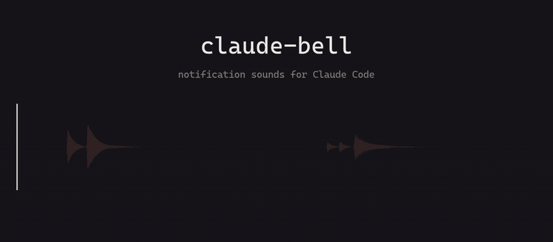

# claude-bell

English | [中文](README.zh-CN.md)

A Claude Code **plugin** that chimes when Claude needs you, so you can safely switch away and do something else. Two slash commands to install — and it runs on Windows, macOS and Linux alike.


[](LICENSE)

| When | Sound |
|------|-------|
| Claude asks for permission / needs your input | "ding-dong?" (rising two-note, question intonation) |
| Claude finishes a task | "ding-dong-DAA!" (same melodic line resolving into a chord) |

Sounds are short (~1s) and soft, share one timbre, and are distinguishable at a glance.

## Hear them



Both chimes, one second apart. The preview above is silent — GitHub won't play audio in the page, so to actually hear them, grab one of these:

- 🔔 [`sounds/notify.wav`](sounds/notify.wav) — **needs your input**, ~1s
- ✅ [`sounds/complete.wav`](sounds/complete.wav) — **task complete**, ~1s
- 🎬 [`assets/demo.mp4`](assets/demo.mp4) — both of them, with sound, 4s

## Install

```
/plugin marketplace add ChALyX/claude-bell
/plugin install claude-bell@claude-bell
```

Or clone and install from a local path:

```
/plugin marketplace add /path/to/claude-bell
/plugin install claude-bell@claude-bell
```

**Restart Claude Code** to activate. `/reload-plugins` is not enough — hook config is only read at startup, and reloading plugins does not pick it up.

## Adjust volume

Takes effect immediately, no restart needed:

```
/claude-bell:volume 50
```

- Range 0–100, `0` mutes, no argument shows the current volume

## Replace the sounds

Put your own sound files in `~/.claude/claude-bell/` (on Windows: `C:\Users\<you>\.claude\claude-bell\`):

- `notify.wav` — played when Claude asks for confirmation
- `complete.wav` — played when a task completes

If present, they take priority over the built-in sounds; delete them to restore the defaults.

**Supported format: WAV only** (a Windows player limitation), recommended length under 1.5s.

## Slash commands

| Command | Description |
|---------|-------------|
| `/claude-bell:volume <0-100>` | Set volume, effective immediately; `0` mutes; no argument shows current volume |

## When it rings (and when it deliberately doesn't)

<details>
<summary>Why the prompt you answered instantly made no sound — that's the design, not a bug.</summary>

<br>

`notify` rides on Claude Code's `Notification` event, which is **not** emitted the moment a permission prompt appears. Claude Code first waits a few seconds to see whether you are there:

| You | Result |
|-----|--------|
| Answer the prompt right away | Notification is cancelled — **no sound at all**. You were at the keyboard, so it doesn't interrupt you. |
| Leave it unanswered | Event fires and the chime plays, roughly 6.5s after the prompt appeared. |

So silence on a prompt you answered instantly is expected, not a missed sound. This wait is Claude Code's own behaviour: no setting exposes it, and it cannot be shortened from a plugin.

`complete` rides on `Stop`, which has no such wait — it plays at the end of every turn, about 1.3s later. That 1.3s is the cost of spawning a script host and opening an audio device (on Windows, PowerShell + WPF MediaPlayer); it is the only part of the delay this plugin owns.

The 60s idle reminder (`idle_prompt`) is filtered out on purpose and never rings.

*Timings measured on Windows 11; other platforms will differ.*

</details>

## License

[MIT](LICENSE)
